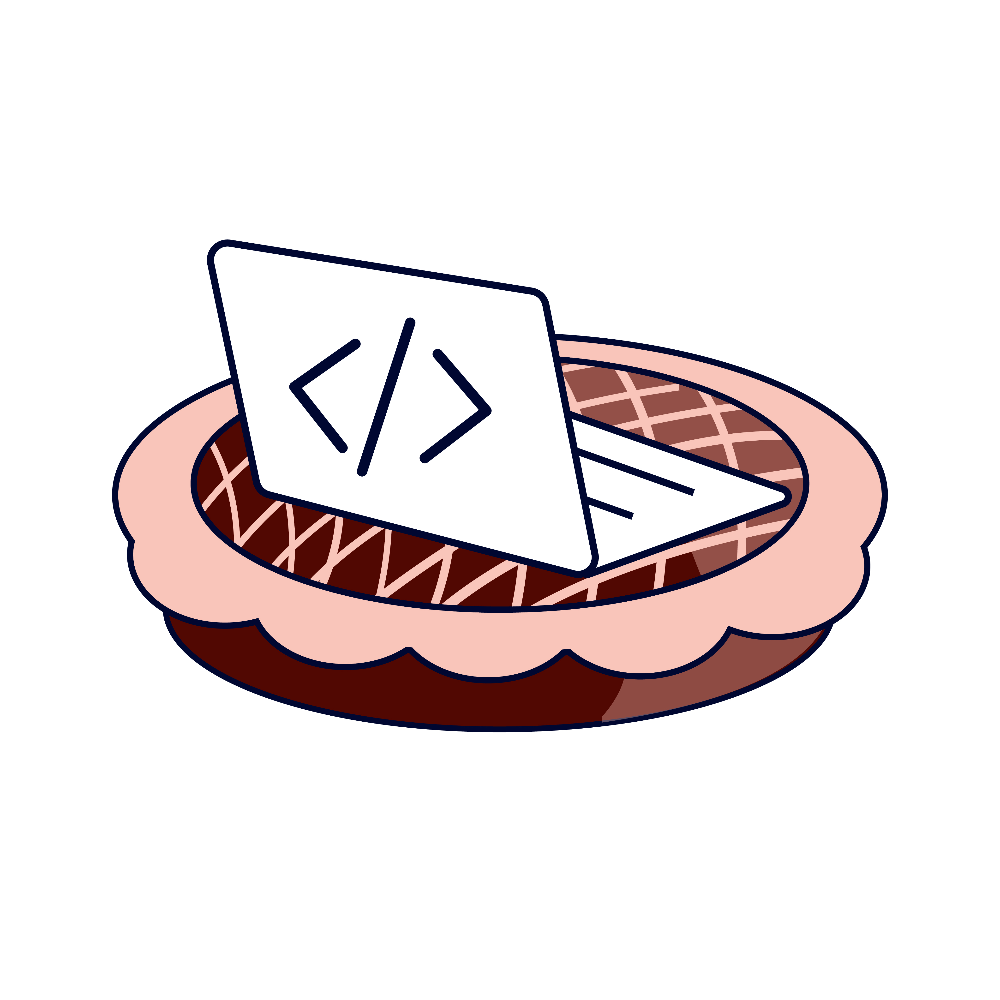

::: registration-banner

Registration for "Documentation and Reprodicibility" is now open!

<a class="btn-register" href="https://library.maastrichtuniversity.nl/events/maastricht-computing-days-programming-on-the-vlaai-visit/" target="_blank">Register Now</a>
:::

::: hero
{width="260px"}

**Based on the CAFE method** - Code Along, Feel Empowered

A relaxed, friendly space to learn and practice scientific coding at Maastricht University.
:::

## What to expect

Each session includes:

- **Themed mini-talk or demo** (30–60 min) on a specific topic
- **Code along** — bring your laptop and work on what matters to you
- **Ask questions** — bring your bugs, errors, and questions
- **Share knowledge** — learn from and help each other
- **Enjoy Vlaai** — good code, good company, good Vlaai

## Session themes

Examples of what we will cover:

Intro to R and Python · Git & GitHub · AI tools for research · Data visualisation · Ethics in coding · and more.

## Upcoming sessions

Sessions are labeled by [skill level](about.qmd#the-levels) — see the About page for details.

::: section-card
| Session | Speaker | Date | Location | Level |
|---------------|---------------|---------------|---------------|---------------|
| [Reproducibility and documentation](https://maastrichtu-library.github.io/programming-on-the-vlaai/sessions.html#workshop-documentation-and-reproducibility-maastricht-computing-days) | Melisse Houbrechts & Alisa Huber | 29 October, 10:00 | TBC | Level 0 – Level 2 |
| [R for Qualitative data](https://maastrichtu-library.github.io/programming-on-the-vlaai/sessions.html#r-for-qualitative-data-for-total-newbies) | Szilvia Zörgő | 24 November, 15:00 | TBC | Level 0 - Level 2 |
:::

## Contact us

Have a question, suggestion, or idea for a session?

Reach out to us at [researchsoftware-ub\@maastrichtuniversity.nl](mailto:researchsoftware-ub@maastrichtuniversity.nl).